# bookManagementApiAWSLambda

La siguiente aplicación serverless se compone de los siguientes recursos:
- Entidades Book, Comment y User
- Repositorios BookRepository y CommentRepository que permiten acceder a una base de 
    datos dynamodb, tanto en local como en la nube dependiendo de una variable de entorno
    definida.
- Servicios BookService y CommentService que definen la logica de la aplicación donde 
    principalmente se realiza una deserializacion de los recursos devueltos por los repositorios
    y devolverlos formateados.
- El main de la aplicación con el handler que recibe las peticiones de los eventos
    y dependiendo del tipo de request, llama a un servicio u otro.
- El pom con las dependencias necesarias (sdk de aws, dynamodb y gson principalmente)
- Los eventos, donde definen las peticiones a enviar a la función lambda en formato json
- El template para generar los recursos con sam en cloudFormation
- La configuracion del sam

Los puntos relevantes para el desarrollo han sido los siguientes:
- El handler donde se bifurcan las peticiones en base a la uri del request
  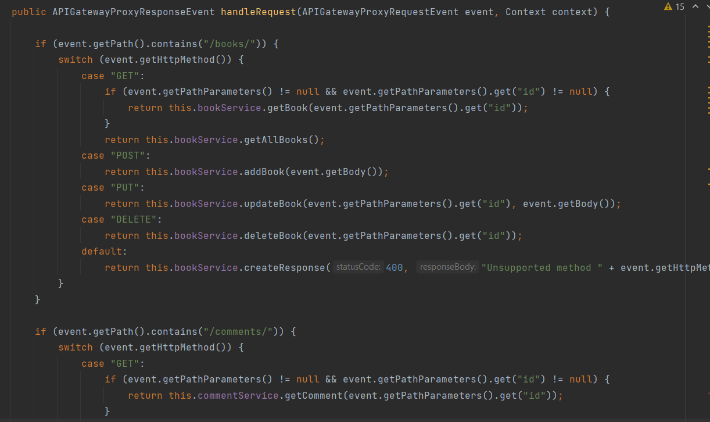
- El servicio donde se realizan los mapeos
  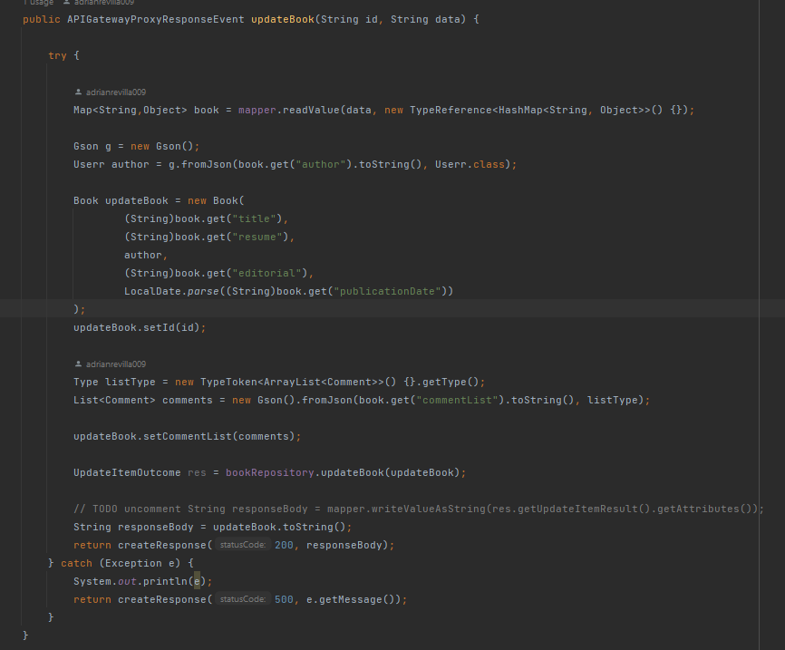
- El repositorio para realizar acciones contra la dynamodb
  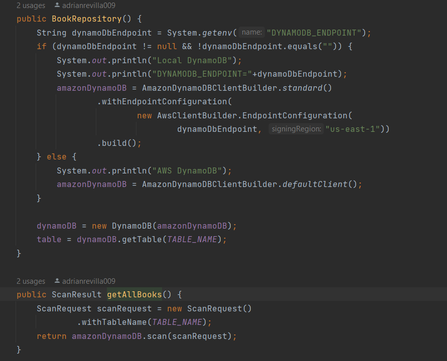
- Los diferentes archivos de eventos para definir las peticiones
  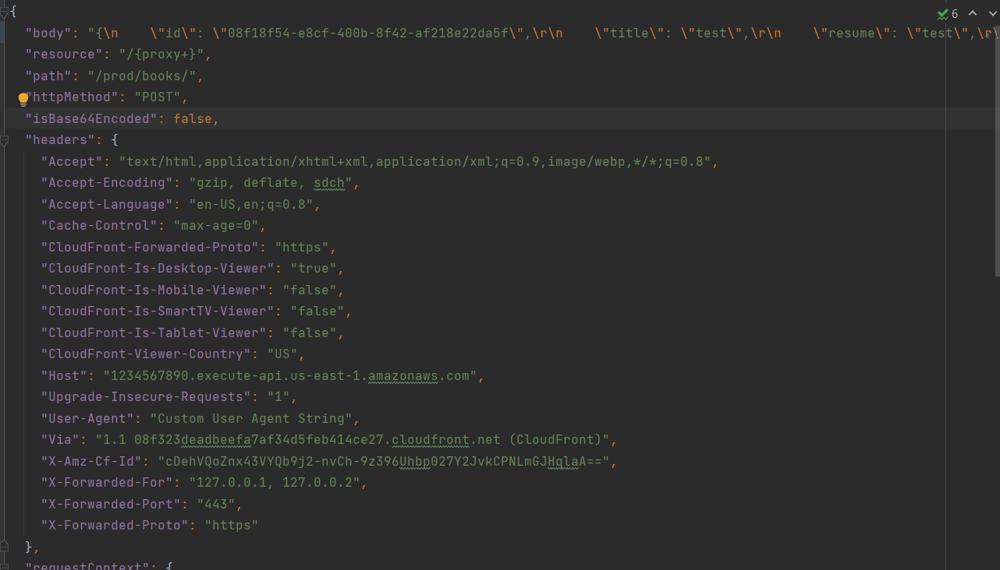
- El template donde se definen los recursos a levantar en el cloud
  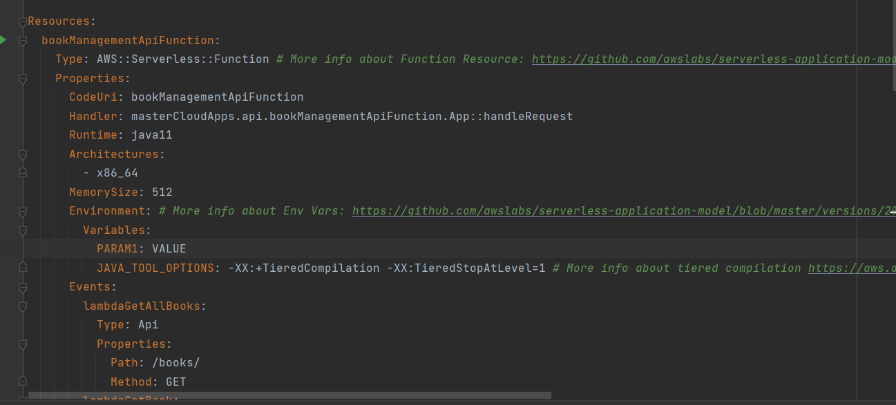
- La configuracion del sam
  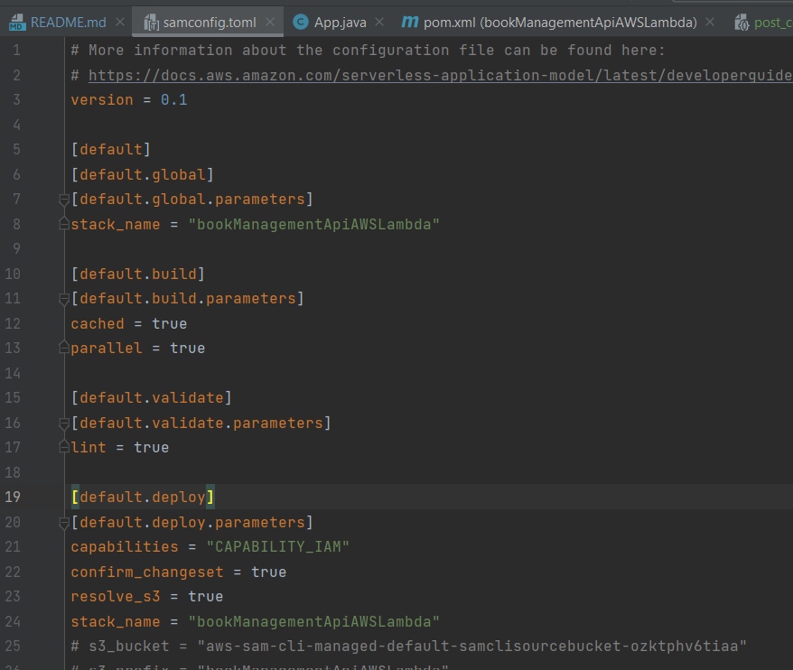

Los puntos relevantes para levantar la funcion lambda han sido:

Local:
- Levantar la dynamodb en local con docker
  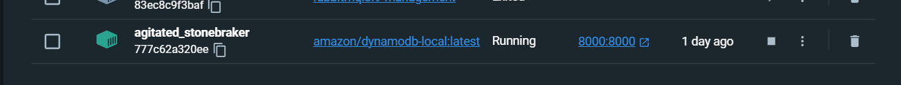
- Definir el lanzado de la aplicacion para ejecutar uno a uno los eventos
  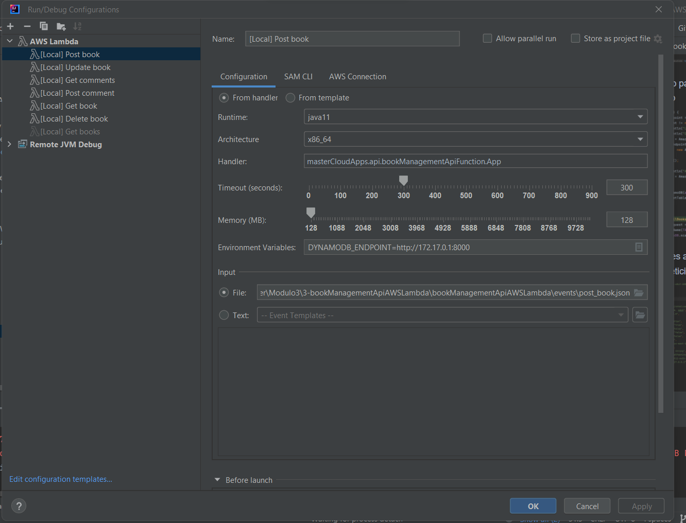
- Ejecución para poder debugear la funcion y realizar el desarrollo de la api
  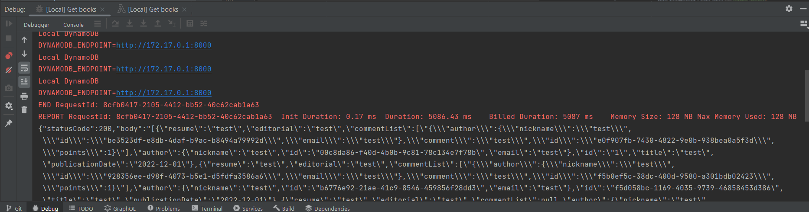

Cloud:
- Levantar los recursos en el cloud con el template y SAM. Los recursos levantados por el stack son:
  Tabla para el dynamodb, roles, funcion lambda, bucket s3, api gateway.
  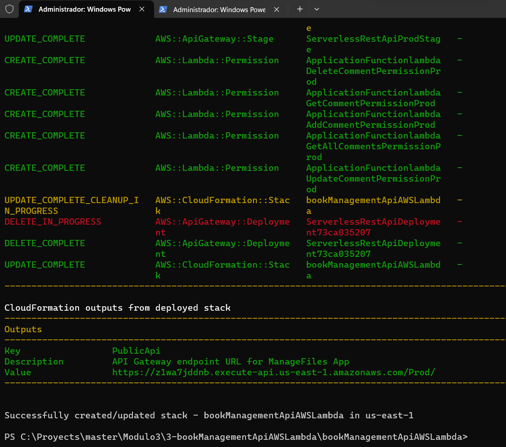
- Comprobar que el stack ha levantado correctamente los recursos
  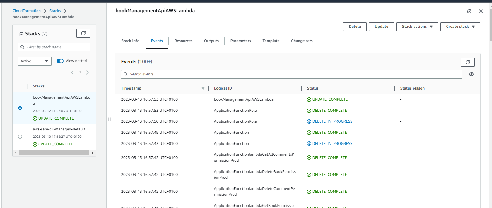
- Comprobar que la funcion lambda esta operativa
  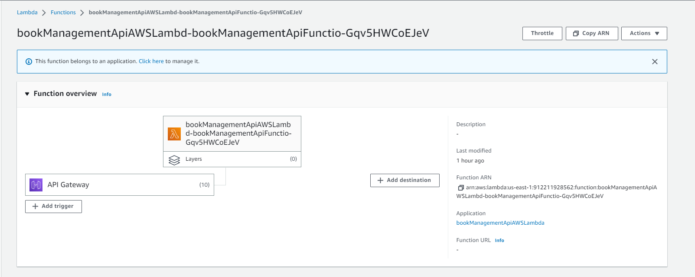
- Asegurar que el usuario configurado con el que se opera en aws tiene los permisos necesarios
    a los recursos para poder levantar el stack con sam: api gateway, s3, iam, dynamodb, cloudformation
  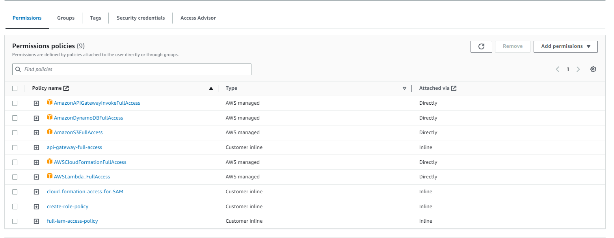
- Comprobar que se pueden realizar operaciones sobre el api gateway expuesta
  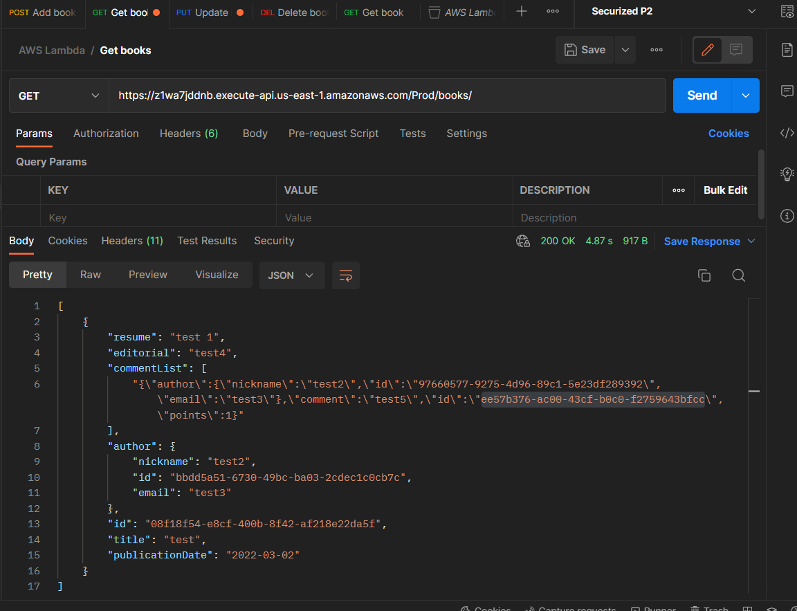

Por falta de tiempo se ha prescindido realizar las operaciones GET comment, POST comment, PUT comment y DELETE comment,
para poder dedicarle mas tiempo a la parte de cloud y lambda, que a la propia serializacion y deserializacion
de los recursos obtenidos desde la dynamodb.

